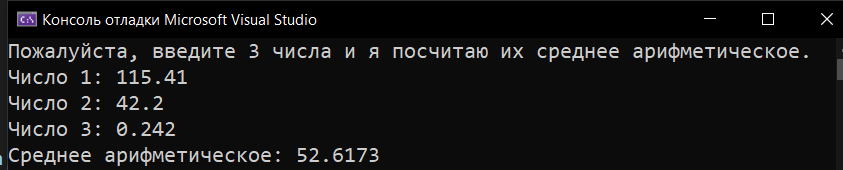

# Homework_1_Data-Types
Д/з: Data types
* [Arithmetic mean](Arithmetic_mean)
* [Equation solution](Equation_Solution)
* [Kilometers to miles](Kilometers_To_Miles)
* [Square and length of circle](Square_And_Length_Of_Circle)

  <h2>Arithmetic mean</h2>
  
Среднее арифметическое

  
  <h2>Equation solution</h2>
  
Решение уравнения

  
  <h2>Kilometers to miles</h2>
  
Перевод километров в мили

  
  <h2>Square and length of circle</h2>
  
Вычисление площади и длины окружности

  

